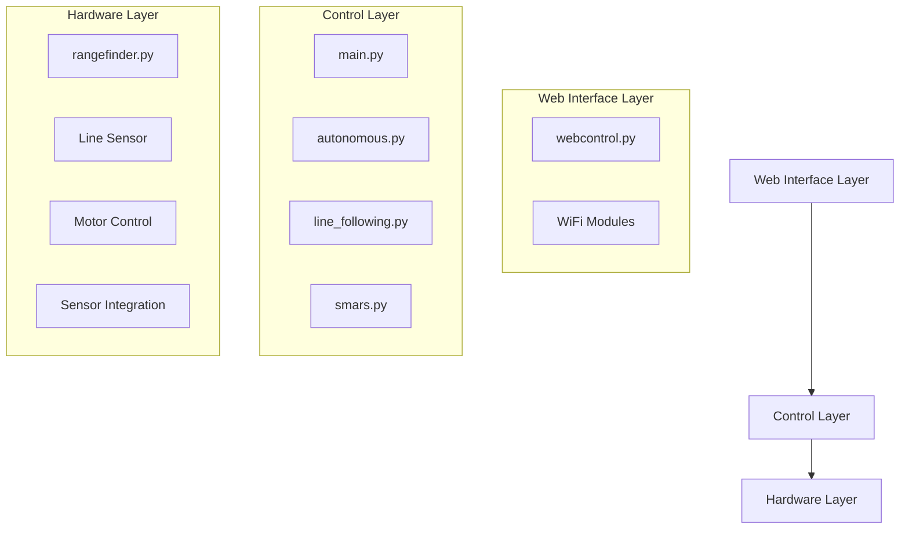
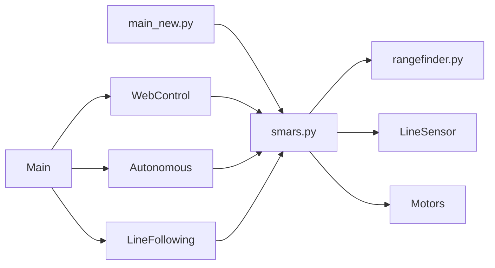

# System Patterns: NewSMARS_pico

## Architecture Overview
The NewSMARS_pico system follows a layered architecture with clear separation of concerns:



## Key Design Patterns

### 1. **Rangefinder Integration Pattern (CONFIRMED WORKING)**
- Clean abstraction layer through SMARS class
- Modular architecture: `rangefinder.py` → `smars.py` → `main_new.py`
- Property-based sensor access for distance readings
- Real-time web interface integration with auto-refresh

```python
# rangefinder.py - Hardware abstraction
class HCSR04:
    def measure_distance(self):
        # Ultrasonic sensor control

# smars.py - Robot abstraction
class SMARS:
    def __init__(self):
        self.range_finder = HCSR04(trigger_pin, echo_pin)
    
    @property
    def distance(self):
        return self.range_finder.measure_distance()

# main_new.py - Web interface
def get_distance():
    return robot.distance  # Clean access through abstraction
```

### 2. Line Following Pattern
- ADC-based line detection
- Threshold-based decision making
- PWM motor speed control
- Emergency stop handling

```python
class LineFollower:
    def __init__(self):
        # ADC and motor pin setup
        
    def read_line_sensor(self):
        # ADC reading and value mapping
        
    def move_based_on_reading(self):
        # Threshold-based movement control
```

### 3. Core Robot Control Pattern
- Class-based encapsulation in `SMARS` class
- Property-based sensor access
- Clean resource management with initialization and cleanup
- Exception handling for hardware failures

```python
class SMARS:
    def __init__(self, ...):
        # Hardware initialization
    
    @property
    def distance(self):
        # Sensor access
    
    def cleanup(self):
        # Resource management
```

### 4. Movement Control Pattern
- Atomic movement operations (forward, backward, turn)
- Optional duration-based movement
- Automatic motor stoppage
- Fail-safe stop operations

### 5. Sensor Integration Pattern
- Abstracted sensor interfaces
- Property-based access
- Threshold-based obstacle detection
- Error handling for sensor failures
- **Confirmed working in main_new.py through SMARS abstraction**

### 6. Autonomous Behavior Pattern
- Reactive obstacle avoidance
- Sensor-based decision making
- Configurable thresholds
- Sequential movement patterns

### 7. Web Interface Integration Pattern
- Real-time sensor data display
- AJAX-based auto-refresh (500ms intervals)
- Clean HTTP request handling
- Responsive sensor feedback
- **Working implementation in main_new.py**

## Component Relationships



**CONFIRMED WORKING ARCHITECTURE:**
- `main_new.py` → `SMARS class` → `rangefinder.py`
- Real-time distance display via `robot.distance` property
- Clean separation of concerns maintained
- Web interface auto-refreshes distance every 500ms

## Technical Decisions

### 1. **Rangefinder Integration Architecture Decision (VALIDATED)**
- **Decision**: Use SMARS class as abstraction layer for rangefinder access
- **Rationale**: Maintains clean separation of concerns, unified robot interface
- **Implementation**: `rangefinder.py` → `smars.py` → `main_new.py`
- **Result**: Working real-time distance sensing in web interface
- **Status**: User confirmed this approach as optimal

### 2. Hardware Abstraction
- Pin configuration through constructor
- Abstracted hardware access
- Centralized error handling
- Clean shutdown procedures

### 3. Control Flow
- Event-driven web control
- Reactive autonomous control
- Interruptible movements
- State-based operation modes

### 4. Error Handling
- Initialization validation
- Sensor reading verification
- Graceful degradation
- Resource cleanup

### 5. Testing Strategy
- Component-level testing
- WiFi connectivity testing
- Sensor validation
- Integration testing
- **Architecture validation testing completed**

## Code Organization Patterns

### 1. Module Structure
```
newsmars/
├── __init__.py      # Package initialization
├── main.py          # Entry point
├── smars.py         # Core robot class
├── autonomous.py    # Autonomous behavior
├── rangefinder.py   # Sensor interface
├── webcontrol.py    # Web interface
└── test_*.py        # Test modules
```

### 2. Dependency Management
- Clear import hierarchy
- Minimal cross-module dependencies
- Hardware abstraction layers
- Isolated test modules

## Implementation Guidelines

1. **Hardware Initialization**
   - Always validate pin configurations
   - Initialize hardware in a specific order
   - Implement cleanup on failure
   - Verify sensor readings

2. **Movement Control**
   - Ensure motors stop after timed movements
   - Implement smooth transitions
   - Validate movement commands
   - Handle interrupted movements

3. **Sensor Integration**
   - Regular sensor polling
   - Threshold-based decisions
   - Error handling for bad readings
   - Calibration support

4. **Web Control**
   - Responsive command handling
   - State synchronization
   - Connection management
   - Error reporting
